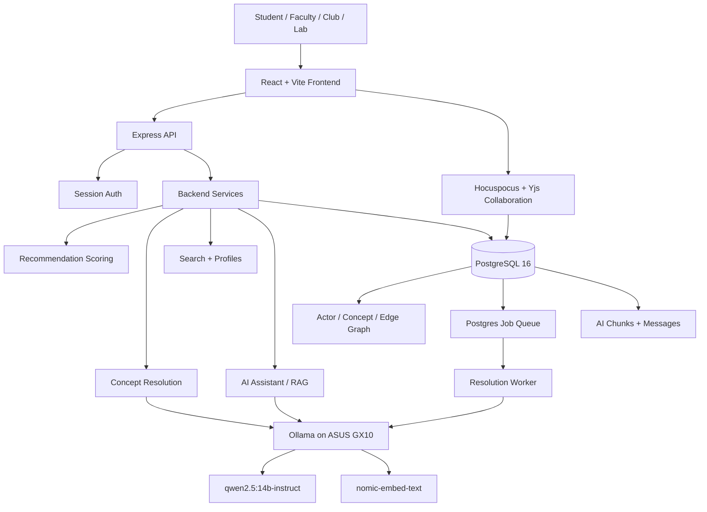

# Link

Link is a StudentOS-style campus discovery platform that answers one question: **who here should I be talking to, and why?** It connects students, faculty, clubs, labs, departments, interests, projects, conversations, and shared contexts into one explainable graph so people can find collaborators, mentors, communities, and opportunities they would otherwise miss.

Live demo: [https://linkmit.duckdns.org](https://linkmit.duckdns.org)

> Note: the browser may warn that the site is not secure while the new SSL certificate is still being issued or trusted. The app is self-hosted for the hackathon, so certificate state may briefly lag behind deployment.

## Why We Built It

Outside deeply connected environments, it is surprisingly hard to find people who share your academic or personal interests, especially when those interests are niche. Link was built to make those hidden connections visible for students, faculty, clubs, labs, and departments.

The product is not just a directory. A ranked list of names is not enough. Link treats the **reason** behind a suggestion as a first-class part of the response, so every recommendation shows the evidence that made the match meaningful.

## What It Does

- Lets users describe interests, projects, goals, and background in natural language.
- Resolves messy phrases like "ML", "machine learning", and "statistical learning" into shared concepts.
- Builds a campus knowledge graph from people, organizations, interests, and relationships.
- Recommends people, clubs, labs, and departments with clear reasons attached.
- Shows an interactive homepage map where people sit inside the interests they share with you.
- Supports live collaborative workspaces and an AI assistant over conversations and files.
- Runs the backend, database connections, and local LLM stack on an ASUS GX10.

## Architecture



The frontend talks to the API under `/api`, and the backend stores the source of truth in PostgreSQL. Slow AI work is pushed into a Postgres-backed job queue so normal requests stay fast; workers claim jobs with `SELECT ... FOR UPDATE SKIP LOCKED`, which lets multiple workers drain the queue safely without Redis or another broker.

## How The Matching Works

Link stores campus knowledge as a graph:

- `actor`: people, clubs, labs, departments, companies
- `concept`: canonical interests with 768-dimensional embeddings
- `concept_alias`: every messy phrase users have typed, mapped back to a concept
- `actor_concept`: which actor cares about which concept
- `context`: shared courses, events, papers, projects, teams, or labs
- `edge`: graph relationships such as membership, affiliation, attendance, authorship, and advising

When a user enters an interest, Link resolves it with a cheapest-first cascade:

1. Exact alias lookup
2. Fuzzy trigram match with `pg_trgm`
3. Vector similarity with `nomic-embed-text`
4. LLM adjudication with `qwen2.5:14b-instruct`
5. New concept proposal if nothing matches

The key threshold rule:

```math
\text{accept if } \cos(e_q, e_c) \ge 0.92
```

```math
\text{ask the LLM if } 0.60 \le \cos(e_q, e_c) < 0.92
```

That `0.60` adjudication floor was measured against messy labelled strings for `nomic-embed-text`; changing the embedding model means the threshold must be re-tested.

## Recommendation Score

Suggestions are ordered by graph evidence, not by an opaque percentage. The score is unbounded and viewer-relative, so it is safe for ranking only.

```math
\text{score}(a,b)
= \sum_c \text{idf}(c)\,s(a,c)\,s(b,c)\,\gamma^{hops(c)}
+ \sum_x w(x)\,rec(x)
- \lambda\,connected(a,b)
```

Where:

- `idf(c)` makes rare shared interests count more than common ones.
- `s(a,c)` and `s(b,c)` are each actor's strength for a concept.
- `gamma = 0.15` decays related concepts by graph distance.
- `rec(x)` decays shared contexts by age with a 3-year half-life.
- `lambda = 5` penalizes people or organizations that are already connected.

Every suggestion returns up to three reasons, such as:

- "Both interested in neural networks"
- "Both connected to Hack Night 2024"
- "Both share an interest in human computer interaction"

## AI Models

The model runtime is self-hosted through Ollama on the ASUS GX10:

- **Reasoning / adjudication:** `qwen2.5:14b-instruct`
- **Embeddings:** `nomic-embed-text`
- **Embedding size:** 768 dimensions, matching `concept.embedding vector(768)`
- **Reasoning mode:** `LLM_REASONING_EFFORT=none`

LLMs help Link understand human language, but PostgreSQL stores the durable graph. That keeps recommendations explainable, cacheable, and auditable instead of asking a model to invent matches on every request.

## Homepage

The homepage is designed around two questions:

1. Who should I talk to?
2. Why them?

The current homepage uses an interactive interest map. The viewer sits at the center, their top interests become translucent overlapping fields, and recommended people appear inside the interests they share. Selecting a person opens a detail panel with the specific reasons behind the match.

Important design rules:

- The "why" must be visible, not hidden behind pure ranking.
- Color never carries meaning alone; interest labels and accessible labels mirror the visual state.
- Motion is optional and freezes for reduced-motion users.
- If the visual cannot truthfully encode a relationship, the UI says so instead of implying false structure.

## Tech Stack

- **Frontend:** React 18, Vite, TypeScript
- **Backend:** TypeScript, Express 4, ES modules
- **Database:** PostgreSQL 16, handwritten SQL with `pg`
- **Extensions:** `pgvector`, `pg_trgm`, `pgcrypto`
- **Collaboration:** Hocuspocus 4, Yjs
- **AI runtime:** Ollama, OpenAI-compatible endpoints
- **Deployment:** Docker Compose, nginx, ASUS GX10

## Data

The demo database uses generated fictional campus people and organizations, plus open data sources for realistic vocabularies:

- Computer Science Ontology
- NCES Classification of Instructional Programs 2020
- Public-domain hobby data
- Public-domain name datasets

No seeded person represents a real student or faculty member.

## Running Locally

Install dependencies:

```bash
npm install
cd web && npm install
```

Create an environment file:

```bash
cp .env.example .env
```

Run migrations and seed data:

```bash
npm run dev:migrate
npm run dev:seed
```

Start the backend and worker:

```bash
npm run dev:api
npm run dev:resolution-worker
```

Start the frontend:

```bash
cd web
npm run dev
```

The frontend runs at `http://localhost:5173` and proxies `/api` to the backend.

For frontend-only development, open:

```text
http://localhost:5173/?fixtures=1
```

That mode uses canned fixture data and does not require Postgres or Ollama.

## Team

- **Prasant:** Backend services, concept resolution, recommendation logic, LLM selection/configuration, and self-hosting the full system on the ASUS GX10.
- **Qain:** Frontend, database design, data modeling, and user experience.

## What's Next

- Test Link with larger real communities and more complex campus graphs.
- Pilot the system with universities, clubs, labs, or departments.
- Improve recommendations using feedback from actual student and faculty interactions.
- Add organization-facing tools so clubs and labs can find interested students.
